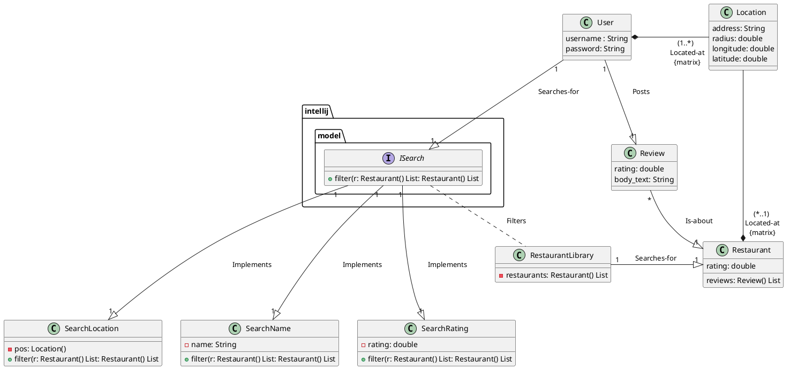
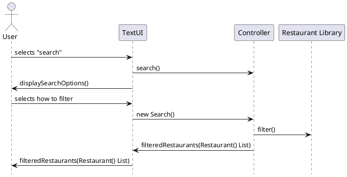
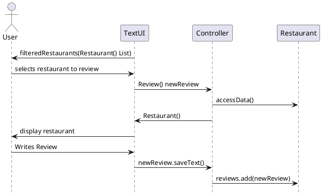

```plantuml
@startuml

' classes

interface intellij.model.ISearch{
    +filter(r: Restaurant() List: Restaurant() List
}

class SearchLocation{
    -pos: Location()
    +filter(r: Restaurant() List: Restaurant() List
}

class SearchName{
    -name: String
    +filter(r: Restaurant() List: Restaurant() List
}

class SearchRating{
    -rating: double
    +filter(r: Restaurant() List: Restaurant() List
}

class RestaurantLibrary{
    -restaurants: Restaurant() List
}

class User{
    username : String
    password: String
   }
   
class Location{
    address: String
    radius: double
    longitude: double
    latitude: double
}   
   
class Review{
    rating: double
    body_text: String
    
    }
    
class Restaurant{
    reviews: Review() List
    rating: double
    }

' associations
User "1" -|> "1" Review : \tPosts\t\t
User *- "(1..*)  \nLocated-at\n{matrix}" Location : \t\t\t\t
Location -* "(*..1) \nLocated-at\n{matrix}" Restaurant: \t\t\t\t
Review "*" --|> "1" Restaurant : \tIs-about\t\t
User "1" --|> "1" intellij.model.ISearch : \tSearches-for\t\t
RestaurantLibrary "1" -|> " 1" Restaurant : \tSearches-for\t\t
intellij.model.ISearch "1" ---|> " 1" SearchLocation : \tImplements\t\t
intellij.model.ISearch "1" ---|> " 1" SearchName : \tImplements\t\t
intellij.model.ISearch "1" ---|> " 1" SearchRating : \tImplements\t\t
'SearchLocation "1" ---|> " 1" RestaurantLibrary : \tFilters\t\t
'SearchRating "1" ---|> " 1" RestaurantLibrary : \tFilters\t\t
intellij.model.ISearch .. RestaurantLibrary : \tFilters\t\t


@enduml
```

```plantuml
@startuml
hide footbox
actor User as user
participant "TextUI" as ui
participant "Controller" as controller
participant "Restaurant Library" as library

user -> ui : selects "search"
ui -> controller: search()
ui -> user: displaySearchOptions()
user -> ui: selects how to filter
ui -> controller: new Search()
controller -> library: filter()
controller -> ui: filteredRestaurants(Restaurant() List)
ui -> user: filteredRestaurants(Restaurant() List)
@enduml
```

```plantuml
@startuml
hide footbox
actor User as user
participant "TextUI" as ui
participant "Controller" as controller
participant "Restaurant" as restaurant
 
ui -> user: filteredRestaurants(Restaurant() List)
user -> ui: selects restaurant to review
ui -> controller: Review() newReview
controller -> restaurant: accessData()
controller -> ui: Restaurant()
ui -> user: display restaurant
user -> ui: Writes Review
ui -> controller: newReview.saveText()
controller -> restaurant: reviews.add(newReview)

@enduml
```
