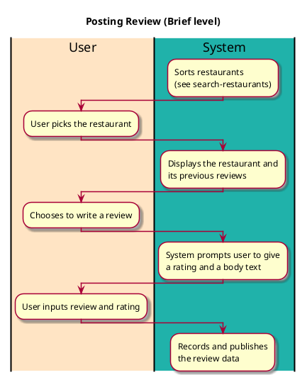

# Posting Review

# 1. Primary actor and goals

* __User__: Posts reviews.

## 2. Other stakeholders and their goals

* __Friends__: Already posted reviews.

## 3. Preconditions

* Restaurants need to be registered.
* Restaurants have been searched for (see search-restaurants)

## 4. Postconditions

* The review is posted and saved.
* The user's can access the review.

## 5. Workflow
 
* Restaurants are displayed
* User searches for restaurant
* Creates a review of a restaurant
* Gives 0-5 star rating with a description.

