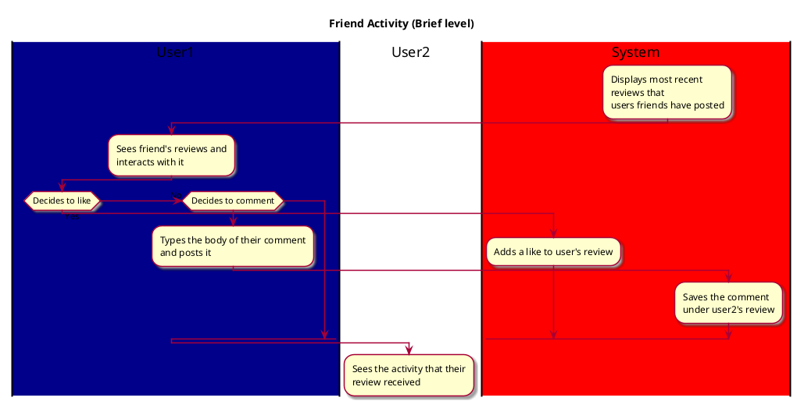

# Friend Activity

## 1. Primary actor and goals

* __First user__: wants to see latest activity on the app
and interact with their friends.

## 2. Other stakeholders and their goals

* __Second user__: Wants their review to reach other people on their friend list,
including the first user.

## 3. Preconditions

* User 2 has posted a review.

## 4. Postconditions

* All data of the review, including likes and comments,
have been saved.

## 5. Workflow
 
* User 1 opens app.
* The app displays reviews that have been recently posted.
* User 1 sees User 2's most recent review and decides
to add a like or comment.
* The app saves this data.
* User 2 sees that their comment had activity.
