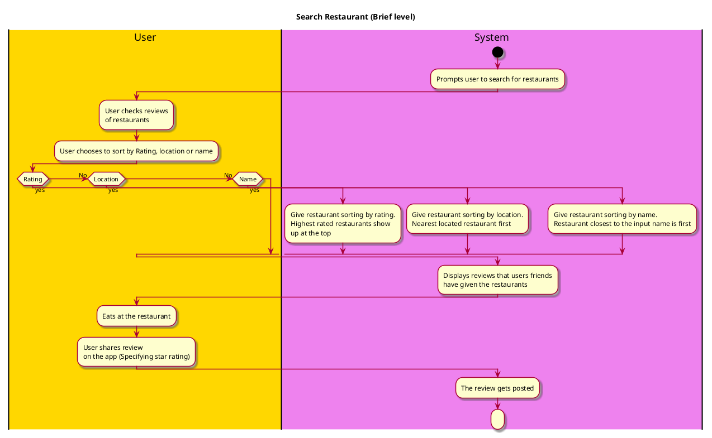

# Search for Restaurants

## 1. Primary actor and goals

* __User__: Search for restaurants.

## 2. Other stakeholders and their goals

* __Friends__: Already given a rating for a restaurant that is being sorted

## 3. Preconditions
 
* Restaurants need to be registered.
* The search conditions are defined.

## 4. Postconditions

* The review is posted and saved.
* The user's can access the review.
* Sorting conditions are reset so they can be reconfigured later

## 5. Workflow

* Display restaurant near the user
* User checks reviews of restaurants
* User sorts the restaurants
* Restaurants are displayed based on preference
* User sees review

